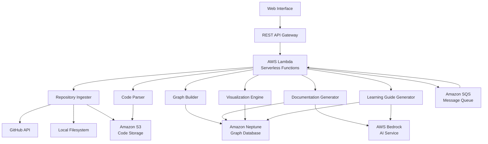
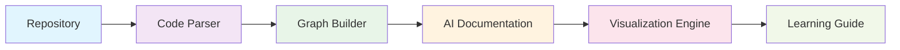

# Design Document: RepoLens

## Overview

RepoLens is a cloud-native, AI-powered platform that transforms GitHub repositories and local codebases into structured documentation, visual maps, and learning paths. Developers often spend hours understanding unfamiliar repositories; RepoLens automates this by generating graph-based relationships, architecture summaries, and interactive visualizations, drastically reducing onboarding and debugging time.

**Impact:** RepoLens reduces developer onboarding time from hours to minutes, helps teams understand unfamiliar codebases instantly, and provides learning paths for junior developers, making it a high-value productivity tool.

**Key differentiators:**
- Multi-language static analysis (Python, JavaScript/TypeScript, Java, Go, Rust)
- Graph-based code relationship modeling using Amazon Neptune
- AI-generated explanations via AWS Bedrock, contextual and scalable
- Visual diagrams and learning guides for accelerated understanding

 **Note**: RepoLens only performs static analysis - It never executes repository code, ensuring safe inspection.

## Architecture Overview

### Processing Flow

**Architecture Highlights:**
- **Microservices**: Each component scales independently, ensuring fault tolerance and reliability
- **Serverless & Event-Driven**: Lambda + SQS pipelines enable automatic scaling and efficient asynchronous processing
- **AI Integration**: Bedrock generates human-readable documentation, architecture summaries, and learning content
- **AI + Visual Synergy**: AI-generated documentation directly linked to interactive visual graphs, enabling intuitive understanding of complex codebases
- **Massive Scale**: Capable of analyzing thousands of repositories concurrently with event-driven scaling

## Components

### 1. Repository Ingester

**Purpose**: Fetch and preprocess repositories from GitHub or local sources.

**Responsibilities**:
- Clone repositories via Git API or read local directories
- Filter files by language/size constraints
- Upload metadata and source content to S3

**Error Handling**:
- Network retries with exponential backoff
- URL validation & permission checks
- Partial ingestion fallback

**Key Interfaces**:
- `ingestGitHubRepository(url: string, options: IngestionOptions): Promise<RepositoryMetadata>`
- `ingestLocalRepository(path: string, options: IngestionOptions): Promise<RepositoryMetadata>`

### 2. Code Parser

**Purpose**: Extract structural information (classes, functions, imports, patterns) across languages.

**Strategy**:
- **AST-based parsing** for accuracy
- **Incremental parsing** for large files
- **Regex fallback** for unsupported constructs

**Supported Languages**: Python, JavaScript/TypeScript, Java, Go, Rust

**Key Interfaces**:
- `parseFile(filePath: string, language: Language): Promise<ParsedStructure>`
- `extractDependencies(structure: ParsedStructure): DependencyGraph`
- `identifyPatterns(structures: ParsedStructure[]): ArchitecturalPattern[]`

### 3. Graph Builder

**Purpose**: Model repository as a graph of code entities in Neptune.

- **Nodes**: File, Module, Class, Function, Variable
- **Edges**: Imports, Calls, Inherits, Implements, Uses

**Key Interfaces**:
- `createStructuralGraph(parsedData: ParsedStructure[]): Promise<GraphId>`
- `addRelationships(graphId: GraphId, relationships: Relationship[]): Promise<void>`
- `queryDependencies(graphId: GraphId, nodeId: string): Promise<DependencyPath[]>`
- `findClusters(graphId: GraphId): Promise<ComponentCluster[]>`

**Neptune Integration**: **Gremlin queries**, **bulk loading**, **index optimization**

### 4. Documentation Generator

**Purpose**: Generate AI-powered explanations & API documentation via Bedrock

**Content Types**: Architecture overviews, component explanations, API docs, design patterns, code quality assessments

**Key Interfaces**:
- `generateArchitectureSummary(graphId: GraphId): Promise<ArchitectureSummary>`
- `explainComponent(nodeId: string, context: GraphContext): Promise<ComponentExplanation>`
- `createAPIDocumentation(interfaces: Interface[]): Promise<APIDocumentation>`

**AI Highlights**:
- **Model selection** by content type
- **Prompt engineering** ensures consistent style & accuracy
- **Context window management** for large codebases

### 5. Visualization Engine

**Purpose**: Produce visual diagrams & dependency flows

**Outputs**: Architecture diagrams, dependency flows, call graphs, module hierarchies

**Formats**: SVG, PNG, interactive HTML, Mermaid

**Key Interfaces**:
- `generateArchitectureDiagram(graphId: GraphId, level: DetailLevel): Promise<Diagram>`
- `createDependencyFlow(startNode: string, endNode: string): Promise<FlowDiagram>`
- `renderComponentDiagram(clusterId: string): Promise<ComponentDiagram>`

### 6. Learning Guide Generator

**Purpose**: Generate beginner-to-advanced learning paths

**Features**:
- Stepwise code explanations
- Design pattern identification 
- Interactive exercises & code examples

**Key Interfaces**:
- `createLearningPath(graphId: GraphId, skillLevel: SkillLevel): Promise<LearningPath>`
- `generateCodeExamples(concepts: Concept[]): Promise<CodeExample[]>`
- `explainPatterns(patterns: ArchitecturalPattern[]): Promise<PatternExplanation[]>`

## Error Handling & Monitoring

**Error Categories**: Network, Processing, Storage

**Strategies**:
- Retry mechanisms & exponential backoff
- Fallback behaviors for AI or parsing failures
- Clear user communication with progress indicators

**Monitoring**:
- Health checks & performance metrics
- Centralized logging & threshold-based alerts

## Testing Strategy

- **Unit Tests** - Component logic, AWS interactions, parsing accuracy
- **Property-Based Tests** - Graph correctness, documentation consistency, AI outputs
- **Integration Tests** - Sample repositories, LocalStack for AWS simulation
- **Performance Tests** - Scalability & resource prioritization

## Hackathon Edge / Innovative Features

- **Multi-language static analysis** with **AST accuracy**
- **Graph-based AI explanations** at module -> function -> line granularity
- **Auto-generated visual diagrams** + **learning paths**
- **Serverless, scalable architecture** with thousands of concurrent repository analyses
- **Safe static inspection** ensures no execution of untrusted code

**Example Flow:** Parsing a Python repo generates a class/function graph -> **Bedrock** generates human-readable component explanations -> **Visualization Engine** renders an interactive module dependency diagram -> **Learning Guide Generator** creates step-by-step tutorials for junior developers.